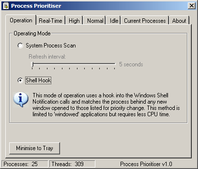

<div align="center">

## Process Priority Manager


</div>

### Description

This monitors your system and changes the priority of any process according to the settings you've made. Can monitor either running processes, or look at each new Window as it opens.

Contains good examples of how to set up System Shell hooks, how to query process-related API calls, how to change the priority of a process, and how to write the worst disclaimer known to man :)

Also, this code would be far better as a two-part app, with the business end running as a system service. Can't be bothered to do it myself though. Anyone who wants to try it is welcome (use my NT Service Manager control, too :) )
 
### More Info
 
Setting the priority of any process to real-time can have catastrophic effects on the performance and stability of your system. This code can do it, but I'd really advise against it.


<span>             |<span>
---                |---
**Submitted On**   |2002-06-13 14:36:38
**By**             |[Sanx](https://github.com/Planet-Source-Code/PSCIndex/blob/master/ByAuthor/sanx.md)
**Level**          |Intermediate
**User Rating**    |4.9 (54 globes from 11 users)
**Compatibility**  |VB 6\.0
**Category**       |[Windows System Services](https://github.com/Planet-Source-Code/PSCIndex/blob/master/ByCategory/windows-system-services__1-35.md)
**World**          |[Visual Basic](https://github.com/Planet-Source-Code/PSCIndex/blob/master/ByWorld/visual-basic.md)
**Archive File**   |[Process\_Pr937426122002\.zip](https://github.com/Planet-Source-Code/sanx-process-priority-manager__1-35775/archive/master.zip)

### API Declarations

```
Declare Function CreateToolhelp32Snapshot Lib "kernel32" (ByVal dwFlags As Long, ByVal dwIdProc As Long) As Long
Declare Function Process32First Lib "kernel32" (ByVal hndl As Long, ByRef pstru As ProcessEntry) As Boolean
Declare Function Process32Next Lib "kernel32" (ByVal hndl As Long, ByRef pstru As ProcessEntry) As Boolean
Declare Function TerminateProcess Lib "kernel32" (ByVal hProcess As Long, ByVal uExitCode As Long) As Long
Declare Function GetExitCodeProcess Lib "kernel32" (ByVal hProcess As Long, lpExitCode As Long) As Long
Declare Function SetPriorityClass Lib "kernel32" (ByVal hProcess As Long, ByVal dwPriorityClass As Long) As Long
Declare Function OpenProcess Lib "kernel32" (ByVal dwDesiredAccess As Long, ByVal bInheritHandle As Long, ByVal dwProcessId As Long) As Long
Declare Function GetLastError Lib "kernel32" () As Long
Declare Function CloseHandle Lib "kernel32" (ByVal hnd As Long) As Boolean
Public Declare Function RegisterWindowMessage Lib "user32" Alias "RegisterWindowMessageA" (ByVal lpString As String) As Long
Public Declare Function RegisterShellHook Lib "Shell32" Alias "#181" (ByVal hwnd As Long, ByVal nAction As Long) As Long
Public Declare Function CallWindowProc Lib "user32" Alias "CallWindowProcA" (ByVal lpPrevWndFunc As Long, ByVal hwnd As Long, ByVal Msg As Long, ByVal wParam As Long, ByVal lParam As Long) As Long
Public Declare Function SetWindowLong Lib "user32" Alias "SetWindowLongA" (ByVal hwnd As Long, ByVal nIndex As Long, ByVal dwNewLong As Long) As Long
Public Declare Function GetWindowLong Lib "user32" Alias "GetWindowLongA" (ByVal hwnd As Long, ByVal nIndex As Long) As Long
Public Declare Function GetWindowThreadProcessId Lib "user32.dll" (ByVal hwnd As Long, ptWord As Long) As Long
Private Declare Function GetWindowText Lib "user32" Alias "GetWindowTextA" (ByVal hwnd As Long, ByVal lpString As String, ByVal cch As Long) As Long
Private Declare Function GetKeyboardLayout Lib "user32" (ByVal dwLayout As Long) As Long
Private Declare Function GetLocaleInfo Lib "kernel32" Alias "GetLocaleInfoA" (ByVal Locale As Long, ByVal LCType As Long, ByVal lpLCData As String, ByVal cchData As Long) As Long
```


